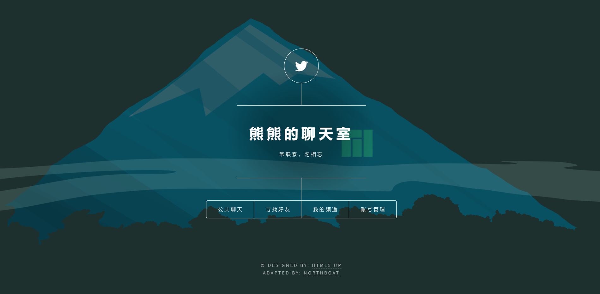

<br><br><br><br><br><br>


<br><br><br><br><br>

<center><h1>设计题目  基于websocket的聊天室应用</h1></center>

<br><br><br>

| 专业名称     | 计算机科学技术                 |
| ------------ | ------------------------------ |
| **班级学号** | **202012143**                  |
| **学生姓名** | **熊舟桐**                     |
| **指导教师** | **王聪**                       |
| **设计时间** | **2023年6月29日—2023年7月3日** |

<br><br><br><br><br><br><br><br>

 <center><h1>课程设计任务书</h1></center>

**专业：计算机科学与技术							学号：202012143							学生姓名：** 

 <br>

**设计题目：基于 websocket 的聊天室应用**

**一、设计实验条件**

Windows 10，JDK17，Maven，MySQL，Redis，IDEA

**二、设计任务及要求**

利用 Java web socket 实现聊天室应用 

实现一个基于 socket 的聊天室应用，允许多个客户端之间进行实时的文本交流，并支持用户注册登录、搜索好友、公共聊天和私聊（保存聊天记录）功能。

**三、设计报告的内容**

1. 设计题目与设计任务（设计任务书）
2. 前言（绪论）(设计的目的、意义等)
3. 设计主体（各部分设计内容、分析、结论等，包括遇到的问题及改进方向）
4. 结束语（设计的收获、体会等）
5. 参考资料

**四、设计时间与安排**

1. 设计时间：1周
2. 设计时间安排
   - 熟悉实验设备、收集资料：1天
   - 设计图纸、实验、计算、程序编写调试：4天
   - 编写课程设计报告：1天
   - 答辩：1天

<br><br><br><br><br><br><br><br><br><br><br><br><br><br><br><br><br><br><br>

## 1. 设计题目与设计任务

**设计题目：**利用JAVA实现聊天室应用

**设计任务：**

本次课程设计的要求是实现一个基于sockets的聊天室应用，允许多个客户端之间进行实时的文本交流，并支持用户注册登录、搜索好友、公共聊天和私聊（保存聊天记录）等功能

## 2. 前言

随着互联网技术的飞速发展，人们之间的沟通方式也在不断演变。在线聊天已成为现代社交生活中不可或缺的一部分。通过使用 WebSocket 实现聊天室，我们可以提供实时消息传输、多人同时在线聊天、消息保存等功能，从而满足用户对快速、实时、互动性强的聊天体验的需求。同时，WebSocket 是一种实时通信协议，相较于传统的 HTTP 协议，具有更低的延迟和更高的效率。因此，本课程设计选择了使用 WebSocket 技术来构建一个聊天室，旨在学习和掌握 WebSocket 技术、学习和掌握 WebSocket 技术并锻炼团队合作和项目管理能力

## 3. 主体设计

### 3.1 聊天功能设计

通过 websocket 实现通讯功能

引入依赖

```xml
<dependency>
    <groupId>org.springframework.boot</groupId>
    <artifactId>spring-boot-starter-websocket</artifactId>
</dependency>
```

websocket 配置（采用默认配置）

```java
package com.northboat.bearchat.config;
import org.springframework.context.annotation.Bean;
import org.springframework.context.annotation.Configuration;
import org.springframework.web.socket.server.standard.ServerEndpointExporter;
@Configuration
public class WebSocketConfig {
    /**
     * WebSocket 服务器节点
     *
     * 如果使用独立的servlet容器，而不是直接使用springboot的内置容器，就不要注入ServerEndpointExporter，因为它将由容器自己提供和管理
     * @return
     */
    @Bean
    public ServerEndpointExporter serverEndpointExporter() {
        return new ServerEndpointExporter();
    }
}
```

websocket 服务实现类

- 将 websocket 服务器绑定在`localhost:8080/chat`这一接口，用户的聊天房间以`localhost:8080/chat/roomName`这一形式存在，并且在这一信道上广播通信
- 私人聊天室的处理即为，用 mysql 数据库存储两个用户的房间号（主键）以及这个房间对应的消息记录，每次用户点击对应房间将房间号以及消息记录返回给前端，用户通过这个房间号连接 websocket 服务器进行通信
- 公共聊天室，即使用一个固定的房间号，如`public`，用户点击后都将进入`localhost:8080/chat/public`信道，并通过广播传输消息

```java
package com.northboat.bearchat.websocket;
import jakarta.websocket.*;
import jakarta.websocket.server.PathParam;
import jakarta.websocket.server.ServerEndpoint;
import lombok.extern.slf4j.Slf4j;
import org.springframework.stereotype.Component;
import org.springframework.stereotype.Service;
import java.io.IOException;
import java.util.concurrent.CopyOnWriteArraySet;

@Component
@Slf4j
@Service
@ServerEndpoint("/chat/{sid}")
public class WebSocketServer {
    //静态变量，用来记录当前在线连接数。应该把它设计成线程安全的。
    private static int onlineCount = 0;
    //concurrent包的线程安全Set，用来存放每个客户端对应的MyWebSocket对象。
    private static final CopyOnWriteArraySet<WebSocketServer> webSocketSet = new CopyOnWriteArraySet<WebSocketServer>();
    //与某个客户端的连接会话，需要通过它来给客户端发送数据
    private Session session;
    //接收sid
    private String sid = "";
    /**
     * 连接建立成功调用的方法
     */
    @OnOpen
    public void onOpen(Session session, @PathParam("sid") String sid) {
        this.session = session;
        this.sid = sid;
        webSocketSet.add(this);     //加入set中
        addOnlineCount();           //在线数加1
        try {
            sendMessage("Connection Test Message");
            log.info("有新窗口开始监听:" + sid + ", 当前总共在线人数为:" + getOnlineCount());
        } catch (IOException e) {
            log.error("websocket IO Exception");
        }
    }
    /**
     * 连接关闭调用的方法
     */
    @OnClose
    public void onClose() {
        webSocketSet.remove(this);  //从set中删除
        subOnlineCount();           //在线数减1
        //断开连接情况下，更新主板占用情况为释放
        log.info("释放的sid为：" + sid);
        //这里写你 释放的时候，要处理的业务
        log.info("有一连接关闭！当前在线人数为" + getOnlineCount());
    }

    /**
     * 收到客户端消息后调用的方法
     * @ Param message 客户端发送过来的消息
     */
    // 全双工通信，服务器接收到客户端的消息后进行处理，可以是分发，可以是其他
    // 这里是将信息发送给 sid 相同的所有连接
    @OnMessage
    public void onMessage(String message, Session session) {
        log.info("收到来自窗口 " + sid + " 的信息:" + message);
        //群发消息
        for (WebSocketServer item : webSocketSet) {
            if(item.sid.equals(sid)){
                try {
                    item.sendMessage(message);
                } catch (IOException e) {
                    e.printStackTrace();
                }
            }
        }
    }

    /**
     * @ Param session
     * @ Param error
     */
    @OnError
    public void onError(Session session, Throwable error) {
        log.error("发生错误");
        error.printStackTrace();
    }

    /**
     * 实现服务器主动推送
     */
    public void sendMessage(String message) throws IOException {
        this.session.getBasicRemote().sendText(message);
    }

    /**
     * 群发自定义消息
     */
    public static void sendInfo(String message, @PathParam("sid") String sid) throws IOException {
        log.info("推送消息到窗口" + sid + "，推送内容:" + message);

        for (WebSocketServer item : webSocketSet) {
            try {
                //这里可以设定只推送给这个sid的，为null则全部推送
                if (sid == null) {
                    item.sendMessage(message);
                } else if (item.sid.equals(sid)) {
                    item.sendMessage(message);
                }
            } catch (IOException e) {
                e.printStackTrace();
            }
        }
    }

    public static synchronized int getOnlineCount() {
        return onlineCount;
    }

    public static synchronized void addOnlineCount() {
        WebSocketServer.onlineCount++;
    }

    public static synchronized void subOnlineCount() {
        WebSocketServer.onlineCount--;
    }

    public static CopyOnWriteArraySet<WebSocketServer> getWebSocketSet() {
        return webSocketSet;
    }
}
```

### 3.2 登陆注册实现

使用邮件验证码进行注册和登录

引入 SMTP 邮件服务器依赖

```xml
<!--mail-->
<dependency>
    <groupId>org.springframework.boot</groupId>
    <artifactId>spring-boot-starter-mail</artifactId>
</dependency>
```

配置邮件服务器

```yaml
spring:
  mail:
    host: smtp.qq.com
    username: "northboat@qq.com"
    password: ""
```

邮件发送工具类

```java
package com.northboat.bearchat.utils;
import org.springframework.beans.factory.annotation.Autowired;
import org.springframework.mail.SimpleMailMessage;
import org.springframework.mail.javamail.JavaMailSender;
import org.springframework.stereotype.Component;

@Component
public class MailUtil extends Thread {

    @Autowired
    private JavaMailSender javaMailSender;
    //邮件信息
    private static final String from = "northboat@qq.com";

    public String getFrom(){
        return from;
    }

    //生成6位验证码，包含数字、小写字母、大写字母
    public String generateCode(){
        char[] code = new char[6];
        for(int i = 0; i < 6; i++){
            //floor向下取整，random生成数[0,1)
            int flag = (int)Math.floor(1+Math.random()*3);
            switch (flag) {
                case 1 -> code[i] = (char) Math.floor(48 + Math.random() * 10); //48-57数字
                case 2 -> code[i] = (char) Math.floor(97 + Math.random() * 26);
                case 3 -> code[i] = (char) Math.floor(65 + Math.random() * 26);
            }
        }
        return new String(code);
    }

    public String send(String to, String name) throws org.springframework.mail.MailSendException{
        String code = generateCode();
        SimpleMailMessage message = new SimpleMailMessage();
        message.setFrom(from);
        message.setTo(to);
        message.setSubject("Hello~" + name);
        message.setText("这是您的验证码：" + code);
        javaMailSender.send(message);
        return code;
    }
}
```

通过 Redis 储存邮箱对应验证码（失效时间十分钟），验证时将用户输入和 Redis 数据库中的验证码比对进行验证判定

Redis 工具类（部分）

```java
package com.northboat.bearchat.utils;
import org.springframework.beans.factory.annotation.Autowired;
import org.springframework.data.redis.core.RedisTemplate;
import org.springframework.stereotype.Component;
import org.springframework.util.CollectionUtils;
import java.util.List;
import java.util.Map;
import java.util.Set;
import java.util.concurrent.TimeUnit;

// 待完善
@Component
@SuppressWarnings("all")
public class RedisUtil {

    private RedisTemplate myRedisTemplate;
    @Autowired
    public void setMyRedisTemplate(RedisTemplate myRedisTemplate){
        this.myRedisTemplate = myRedisTemplate;
    }

    //设置有效时间，单位秒
    public boolean expire(String key, long time){
        try{
            if(time > 0){
                myRedisTemplate.expire(key, time, TimeUnit.SECONDS);
            }
            return true;
        }catch (Exception e){
            e.printStackTrace();
            return false;
        }
    }

    //获取剩余有效时间
    public long getExpire(String key){
        return myRedisTemplate.getExpire(key);
    }

    //判断键是否存在
    public boolean hasKey(String key){
        try{
            return myRedisTemplate.hasKey(key);
        }catch (Exception e){
            e.printStackTrace();
            return false;
        }
    }

    //批量删除键
    public void del(String... key){
        if(key != null && key.length > 0){
            if(key.length == 1){
                myRedisTemplate.delete(key[0]);
            } else {
                myRedisTemplate.delete(CollectionUtils.arrayToList(key));
            }
        }
    }

    //获取普通值
    public Object get(String key){
        return key == null ? null : myRedisTemplate.opsForValue().get(key);
    }

    //放入普通值
    public boolean set(String key, Object val){
        try{
            myRedisTemplate.opsForValue().set(key, val);
            return true;
        }catch (Exception e){
            e.printStackTrace();
            return false;
        }
    }

    //放入普通缓存并设置时间
    public boolean set(String key, Object val, long time){
        try{
            if(time > 0){
                myRedisTemplate.opsForValue().set(key, val, time, TimeUnit.SECONDS);
            } else { // 若时间小于零直接调用普通设置的方法放入
                this.set(key, val);
            }
            return true;
        }catch (Exception e){
            e.printStackTrace();
            return false;
        }
    }
}
```

UserServiceImpl.java 登陆注册相关函数实现

```java
public int sign(String account, String password){
    User user = userMapper.queryByEmail(account);
    if(Objects.isNull(user)){
        user = userMapper.queryByName(account);
    }
    if(Objects.isNull(user)){
        return 0;
    }
    if(user.getPassword().equals(password)){
        userMapper.online(user.getName());
        return 1;
    }
    return -1;
}

@Override
public List<User> getOnlineList(String name){
    return userMapper.queryAllOnline();
}

@Override
public int send(String account){
    // 把用户查出来，通过@判断传入的是昵称还是邮箱
    User user = containAt(account) ? userMapper.queryByEmail(account) : userMapper.queryByName(account);
    if(Objects.isNull(user)){
        String code;
        try{
            code = mailUtil.send(account, "");
        }catch (Exception e) {
            e.printStackTrace();
            return 0;
        }
        // 存验证码用邮箱存
        redisUtil.set(account, code, 600);
        return 2;
    }

    String code;
    try{
        code = mailUtil.send(user.getEmail(), user.getName());
    }catch (Exception e) {
        e.printStackTrace();
        return 0;
    }
    // 存验证码用邮箱存
    redisUtil.set(user.getEmail(), code, 600);
    return 1;
}

// 存入在线列表的就是用户网页 session 里的 user，前后端统一
@Override
public boolean verily(String account, String code){
    User user = containAt(account) ? userMapper.queryByEmail(account) : userMapper.queryByName(account);
    if(Objects.isNull(user)){
        return false;
    }
    String c = (String) redisUtil.get(user.getEmail());
    if(code.equals(c)){
        redisUtil.del(user.getEmail());
        return true;
    }
    return false;
}

// 存入在线列表的就是用户网页 session 里的 user，前后端统一
@Override
public int register(String email, String code, String name, String password) {
    String c = (String) redisUtil.get(email);
    if(Objects.isNull(c)){
        return 2;
    }
    if(!c.equals(code)){
        return 2;
    }
    if(!nameValid(name)){
        return 3;
    }
    redisUtil.del(email);
    User user = new User(email, name, password);
    userMapper.add(user);
    return 1;
}

@Override
public boolean logout(String account){
    //        System.out.println(account);
    User user = userMapper.queryByEmail(account);
    if(Objects.isNull(user)){
        user = userMapper.queryByName(account);
    }
    if(Objects.isNull(user)){
        //            System.out.println("nmsl");
        return false;
    }
    userMapper.logout(user.getName());
    return true;
}
```

### 3.3 Controller 层实现

UserController

```java
package com.northboat.bearchat.controller;
import com.northboat.bearchat.pojo.User;
import com.northboat.bearchat.service.impl.UserServiceImpl;
import jakarta.servlet.http.HttpSession;
import org.springframework.beans.factory.annotation.Autowired;
import org.springframework.stereotype.Controller;
import org.springframework.ui.Model;
import org.springframework.web.bind.annotation.RequestMapping;
import org.springframework.web.bind.annotation.RequestParam;
import java.util.*;

@Controller
public class UserController {

    private UserServiceImpl userService;
    @Autowired
    public void setUserService(UserServiceImpl userService){
        this.userService = userService;
    }

    @RequestMapping("/manage")
    public String login(HttpSession session, Model model){
        Integer login = (Integer) session.getAttribute("login");
        if(!Objects.isNull(login)){
            String user = (String) session.getAttribute("user");
            model.addAttribute("login", 1);
            model.addAttribute("user", user);
        }
        return "user/login";
    }

    @RequestMapping("/sign")
    public String sign(Model model, HttpSession session,
                       @RequestParam("account") String account, @RequestParam("password") String password){
        int flag = userService.sign(account, password);
        if(flag == 0){
            model.addAttribute("msg", "用户不存在");
        }else if(flag == -1){
            model.addAttribute("msg", "秘密错误");
        }else if(flag == 1){
            session.setAttribute("login", 1);
            session.setAttribute("user", account);
            model.addAttribute("login", 1);
            model.addAttribute("user", account);
        }
        return "user/login";
    }

    // 发送邮件
    @RequestMapping("/send")
    public String send(Model model, HttpSession session, @RequestParam("account") String account){
        int status = userService.send(account);
        System.out.println(status);
        session.setAttribute("user", account);
        if(status == 1){
            return "user/verify";
        } else if(status == 2){
            return "user/register";
        }
        model.addAttribute("msg", "验证码发送失败");
        return "user/login";
    }

    // 已注册，登录验证
    @RequestMapping("/verify")
    public String verify(Model model, HttpSession session, @RequestParam("code") String code){
        String account = (String) session.getAttribute("user");
        if(Objects.isNull(account)){
            model.addAttribute("msg", "请先获取验证码");
            return "user/login";
        }
        if(userService.verily(account, code)){
            System.out.println("登录成功");
            // 登录成功
            session.setAttribute("login", 1);
            session.setAttribute("user", account);
            model.addAttribute("login", 1);
            model.addAttribute("user", account);
            return "user/login";
        }
        model.addAttribute("msg", "验证码错误");
        return "user/verify";
    }

    // 已注册，登录验证
    @RequestMapping("/register")
    public String register(Model model, HttpSession session, @RequestParam("code") String code,
                           @RequestParam("name") String name, @RequestParam("password") String password){
        String email = (String) session.getAttribute("user");
        if(Objects.isNull(email)){
            model.addAttribute("msg", "请先获取验证码");
            return "user/login";
        }
        int flag = userService.register(email, code, name, password);
        if(flag == 2){
            model.addAttribute("msg", "验证码错误");
            return "user/register";
        } else if(flag == 3){
            model.addAttribute("msg", "昵称已被使用或含有违规字符@");
            return "user/register";
        }
        session.setAttribute("login", 1);
        session.setAttribute("user", name);
        model.addAttribute("login", 1);
        model.addAttribute("user", name);
        return "user/login";
    }

    @RequestMapping("/logout")
    public String logout(HttpSession session, Model model){
        String user = (String) session.getAttribute("user");
        if(!userService.logout(user)){
            model.addAttribute("msg", "退出登录失败");
            return "user/login";
        }
        session.removeAttribute("user");
        session.removeAttribute("login");
        return "index";
    }
}
```

ChatController.java

```java
package com.northboat.bearchat.controller;
import com.northboat.bearchat.pojo.Message;
import com.northboat.bearchat.pojo.Room;
import com.northboat.bearchat.pojo.User;
import com.northboat.bearchat.service.RoomService;
import com.northboat.bearchat.service.UserService;
import com.northboat.bearchat.websocket.WebSocketServer;
import jakarta.servlet.http.HttpSession;
import org.springframework.beans.factory.annotation.Autowired;
import org.springframework.stereotype.Controller;
import org.springframework.ui.Model;
import org.springframework.web.bind.annotation.*;
import java.util.HashMap;
import java.util.List;
import java.util.Map;
import java.util.Objects;

@Controller
public class ChatController {
    private UserService userService;
    @Autowired
    public void setUserService(UserService userService){
        this.userService = userService;
    }

    private RoomService roomService;
    @Autowired
    public void RoomService(RoomService roomService){
        this.roomService = roomService;
    }

    @RequestMapping("/park")
    public String park(HttpSession session, Model model){
        int count = WebSocketServer.getOnlineCount() + 1;
        model.addAttribute("count", count);
        model.addAttribute("room", "park");
        return "chat/public";
    }

    @RequestMapping("/channel")
    public String rooms(HttpSession session, Model model){
        Integer login = (Integer) session.getAttribute("login");
        if(Objects.isNull(login) || login == 0){
            model.addAttribute("msg", "请先登录");
            return "user/login";
        }
        String account = (String) session.getAttribute("user");
        String name = userService.getName(account);
        List<Room> rooms = roomService.getRooms(name);

        model.addAttribute("rooms", rooms);
        return "chat/room";
    }

    @GetMapping("/room/{id}")
    public String channel(HttpSession session, Model model, @PathVariable("id") Integer id){
        String account = (String) session.getAttribute("user");
        if(Objects.isNull(account)){
            model.addAttribute("msg", "请先登录");
            return "user/login";
        }
        Room room = roomService.getRoomByID(id);
        if(Objects.isNull(room)){
            model.addAttribute("msg", "房间不存在");
            String name = userService.getName(account);
            List<Room> rooms = roomService.getRooms(name);
            model.addAttribute("rooms", rooms);
            return "chat/room";
        }
        String name = userService.getName(account);
        if(!room.getUser1().equals(name) && !room.getUser2().equals(name)){
            model.addAttribute("msg", "没有访问权限");
            return "chat/room";
        }
        List<Message> messages = roomService.getMessage(id);
        // 房间信息
        model.addAttribute("room", room);
        // 消息记录返到房间，显示
        model.addAttribute("messages", messages);
        return "chat/channel";
    }

    @RequestMapping("pick")
    public String pick(HttpSession session, Model model){
        String account = (String) session.getAttribute("user");
        if(Objects.isNull(account)){
            model.addAttribute("msg", "请先登录");
            return "user/login";
        }
        String name = userService.getName(account);
        List<User> list = userService.getOnlineList(name);
        model.addAttribute("friends", list);
        return "chat/pick";
    }

    @RequestMapping("search")
    public String search(Model model, @RequestParam("account") String account){

        List<User> list = userService.searchUser(account);
        model.addAttribute("friends", list);
        return "chat/pick";
    }

    @GetMapping("/build/{name}")
    public String build(HttpSession session, Model model, @PathVariable("name") String user2) {
        String user1 = (String)session.getAttribute("user");
        Map<String, String> params = new HashMap<>();
        params.put("user1", user1);
        params.put("user2", user2);
        roomService.add(params);

        List<Room> rooms = roomService.getRooms(user1);
        model.addAttribute("rooms", rooms);;
        return "chat/room";
    }

    @GetMapping("/delRoom/{id}")
    public String build(HttpSession session, Model model, @PathVariable("id") Integer id) {
        roomService.del(id);
        String user = (String)session.getAttribute("user");
        List<Room> rooms = roomService.getRooms(user);
        model.addAttribute("rooms", rooms);;
        return "chat/room";
    }

    @ResponseBody
    @RequestMapping("/insertMessage")
    public Map<String, Object> addMessage(@RequestParam("from") String from, @RequestParam("to") String to,
                             @RequestParam("room") Integer room, @RequestParam("content") String content){
        Map<String, Object> result = new HashMap<>();
        try{
            Message message = new Message(from, to, room, content);
            roomService.addMessage(message);
            result.put("flag", true);
        }catch (Exception e){
            e.printStackTrace();
            result.put("flag", false);
        }
        return result;
    }
}
```

### 3.4 数据库设计及交互

数据库 ER 图


user 表

```sql
CREATE TABLE `user` (
  `name` varchar(42) NOT NULL COMMENT '用户邮箱',
  `email` varchar(26) NOT NULL COMMENT '用户昵称',
  `online` int(1) NOT NULL DEFAULT '0' COMMENT '在线状态',
  `password` varchar(26) NOT NULL COMMENT '用户密码',
  PRIMARY KEY (`name`,`email`)
) ENGINE=InnoDB DEFAULT CHARSET=utf8mb4
```

room 表

```sql
CREATE TABLE `room` (
  `id` int(11) NOT NULL AUTO_INCREMENT COMMENT '房间序号',
  `user1` varchar(12) NOT NULL COMMENT '用户一',
  `user2` varchar(12) NOT NULL COMMENT '用户二',
  PRIMARY KEY (`id`)
) ENGINE=InnoDB AUTO_INCREMENT=8 DEFAULT CHARSET=utf8mb4
```

message 表

```sql
CREATE TABLE `message` (
  `id` int(11) NOT NULL AUTO_INCREMENT COMMENT '消息记录序号',
  `from` varchar(12) NOT NULL COMMENT '发送消息用户',
  `to` varchar(12) NOT NULL COMMENT '接收消息用户',
  `received` int(1) DEFAULT '0' COMMENT '是否已读',
  `room` int(11) NOT NULL COMMENT '所属聊天室序号',
  `content` varchar(400) NOT NULL COMMENT '聊天消息',
  PRIMARY KEY (`id`)
) ENGINE=InnoDB AUTO_INCREMENT=25 DEFAULT CHARSET=utf8mb4
```

数据库调用采用 MyBatis 框架

mysql 配置

```yaml
spring:
  datasource:
    username: root
    password: ""
    url: jdbc:mysql://43.163.218.127:3306/bearchat?useUnicode=true&characterEncoding=utf-8
    driver-class-name: com.mysql.cj.jdbc.Driver
```

MyBatis 部分文件举例

RoomMapper.java

```java
package com.northboat.bearchat.mapper;
import com.northboat.bearchat.pojo.Room;
import org.apache.ibatis.annotations.Mapper;
import org.springframework.stereotype.Repository;
import java.util.List;
import java.util.Map;

@Mapper
@Repository
public interface RoomMapper {
    List<Room> getRoomByUser1(String user1);
    List<Room> getRoomByUser2(String user2);
    Room getRoomByID(int id);
    void addRoom(Map<String, String> params);
    void delRoom(int id);
}
```

RoomMapper.xml

```xml
<?xml version="1.0" encoding="UTF-8" ?>
<!DOCTYPE mapper
        PUBLIC "-//mybatis.org//DTD Mapper 3.0//EN"
        "http://mybatis.org/dtd/mybatis-3-mapper.dtd">
<mapper namespace="com.northboat.bearchat.mapper.RoomMapper">
    <insert id="addRoom" parameterType="Map">
        insert into room (user1, user2) values (#{user1},#{user2})
    </insert>

    <delete id="delRoom">
        delete from room where id = #{id}
    </delete>

    <select id="getRoomByID" resultType="com.northboat.bearchat.pojo.Room">
        select * from room where id = #{id}
    </select>

    <select id="getRoomByUser1" resultType="com.northboat.bearchat.pojo.Room">
        select * from room where user1 = #{name}
    </select>

    <select id="getRoomByUser2" resultType="com.northboat.bearchat.pojo.Room">
        select * from room where user2 = #{name}
    </select>
</mapper>
```

### 3.5 前端设计

采用开源模板：[Dimension | HTML5 UP](https://html5up.net/dimension)

前端连接 websocket 的 JS 代码以及 Ajax 调用

```js
let websocket = null;
let room  = document.getElementById("room").innerText;
let flag = true;
/*
当为公共聊天室时，这里要稍作修改
let user = sessionStorage.getItem("user")
if(user == null){
	user = "pass by"
}
*/
let user = sessionStorage.getItem("user")
let user1 = document.getElementById("user1").innerText
let user2 = document.getElementById("user2").innerText
if(user === user2){
    user2 = user1;
    user1 = user;
}

//console.log(room);
//判断当前浏览器是否支持WebSocket
if(room === "null"){
    throw SyntaxError();
} else if('WebSocket' in window) {
    //改成你的地址http
    websocket = new WebSocket("ws://localhost:8080/chat/"+room);
} else {
    alert('当前浏览器 Not support websocket')
}

if(websocket == null){
    throw SyntaxError();
}

//连接发生错误的回调方法
websocket.onerror = function() {
    setMessageInnerHTML("WebSocket 连接发生错误");
    throw SyntaxError();
};

//连接成功建立的回调方法
websocket.onopen = function() {
    setMessageInnerHTML("WebSocket 连接成功");
}
//let U01data, Uidata, Usdata;
//接收到消息的回调方法
websocket.onmessage = function(event) {
    console.log(event);
    setMessageInnerHTML(event.data);
}

//连接关闭的回调方法
websocket.onclose = function() {
    setMessageInnerHTML("WebSocket 连接关闭");
}

//监听窗口关闭事件，当窗口关闭时，主动去关闭websocket连接，防止连接还没断开就关闭窗口，server端会抛异常。
window.onbeforeunload = function() {
    closeWebSocket();
}

//将消息显示在网页上
function setMessageInnerHTML(innerHTML) {
    document.getElementById('message').innerHTML += innerHTML + '<br/><br/>';
}

function insertMessage(message){
    let params = {
        "from": user1,
        "to": user2,
        "room": room,
        "content": message
    };
    $.post("http://localhost:8080/insertMessage",params,function(result){
        // console.log("nmsl")
        console.log(result)
        if(result.flag == true){
            //跳转到indexUI对应的页面
            console.log("insert message successfully");
        }else{
            console.log("error");
        }
        return false;//防止刷新时重复提交
    });
}

//关闭WebSocket连接
function closeWebSocket() {
    websocket.close();
}

function clean(){
    let used = document.getElementById("used")
    while(used.firstChild){
        used.removeChild(used.firstChild)
    }
    document.getElementById("message").innerHTML = ""
}

function store(){
    flag = !flag
    console.log(flag)
}

//发送消息
function send() {
    let message = document.getElementById('text').value;
    websocket.send("<strong>"+user1+"</strong><br>" + message);
    document.getElementById("text").value = "";
    if(flag){
        insertMessage(message);
    }
}
```

部分前端页面展示




### 3.6 完整源码

参照 GitHub 仓库：[northboat/Bear-ChatRoom: 基于 websocket 的私人聊天室，计网课设 (github.com)](https://github.com/northboat/Bear-ChatRoom)

## 4. 结束语

在这个课程设计项目中，我们深入学习和掌握了 WebSocket 技术，并成功地设计和实现了一个实时、高效、可扩展的聊天室系统。通过团队合作和不懈努力，我们克服了各种挑战，并取得了令人满意的结果。

基于此，我们不仅学会了如何利用 WebSocket 技术来构建实时通信系统，还提升了我们的团队合作能力和项目管理能力。我们通过需求分析、系统设计、编码实现、测试和评估等环节，充分锻炼了自己的沟通协作技巧和问题解决能力。

在整个项目过程中，我们经历了许多挑战和困难，但我们通过相互支持和积极解决问题的态度，成功地克服了这些困难。我们紧密合作，相互学习，共同努力，最终实现了一个功能完备、性能优良的聊天室系统。

最后，通过本次课程设计，我们收获了更多的知识和经验，为我们今后的学习和工作打下了坚实的基础。我们深刻理解了实时通信和用户交互的重要性，也认识到了项目管理和团队合作的意义。同时，我们也更加熟悉了前端界面设计和后端服务搭建等方面的知识，为我们未来的发展提供了宝贵的参考和指导

## 5. 参考书籍

【1】王罡，林立志.基于Windows的TCP/IP编程.清华大学出版社